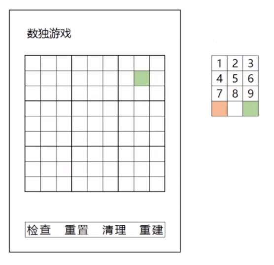
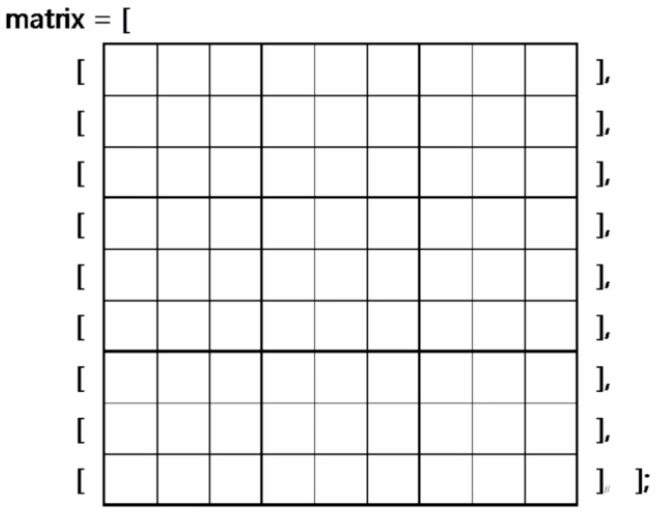
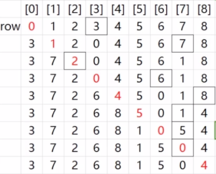
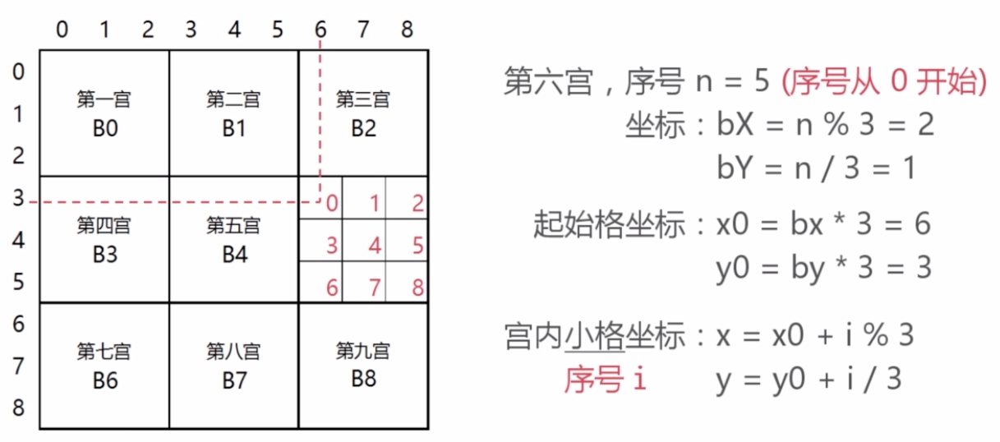

# 数独游戏

> 一个基于VUX的项目

## 构建步骤

``` bash
# install dependencies
npm install

# serve with hot reload at localhost:8080
npm run dev

# build for production with minification
npm run build

# build for production and view the bundle analyzer report
npm run build --report

# run unit tests
npm run unit

# run e2e tests
npm run e2e

# run all tests
npm test
```

## 设计目标

假设目标终端是智能手机

> 适配iphone6及更大尺寸(分辨率为375x667||720x1280)

纯鼠标(触摸)操作

> 鼠标点击或碰触事件

兼顾PC浏览器

> 可使用开发者工具-移动设备模式

## 界面及操作

### 九宫格

### 弹出数字面板

* 点击数字直接选用该数字填写当前格
* 点击底部中央空白:清除当期格的数字
* 点击底部左右色块:标记当前格具有特殊意义

## 功能按钮

* 检查：检查是否成功完成本局游戏，标记出错的小格
* 重置：重置到本局起始状态
* 清理：清除错误标记
* 重建：放弃当前局，新开一局

## 设计图



## 数据结构

### 数据结构 - 数组

第1维，行，9个数组组成，每行是第二层数组

第2维，格，9个数组组成



```vue
aRow = matrix[i]
aCell = aRow[j]

<!--1-9，0-空白-->
<!--0,"",null,undefined-->
```

## 游戏算法

### 生成算法

不可避免的会用到递归

采用一个简单的算法，从数字1开始

失败重算

随机位置，采用Fisher-Yates洗牌算法



### 检查算法

按行、列、宫

### 数据抽取

> array as result

抽取行数据，So easy

抽取列数据，多转一个弯

抽取宫数据，寻找关系

> 计算方式如下



```vue
<!--当获取了数组之后-->
array = [1,2,3,4,5,6,7,8,9]
<!--与字符串'123456789'比较是否全等-->
array.join('') === '123456789'
```

### 脚本目录结构

```
Sudoku-VUX
├── build                   # 项目配置
├── config                  # 项目配置
├── dist                    # 打包文件
├── node_modules            # 插件资源
├── src                     # 开发目录
│   ├── assets              # 静态资源
│   │   ├── images          # 图片资源
│   │   └── style           # 公共样式
│   ├── components          # 组件目录
│   │   ├── Game            # 游戏页
│   │   └── Home            # 入口页
│   ├── router              # 路由配置
│   │   └── index.js        # 配置文件
│   ├── core                # 算法及数据结构相关脚本
│   │   ├── toolkit.js      # 工具方法集
│   │   ├── generator.js    # 生成数独结局方案
│   │   ├── checker.js      # 检查数独解决方案
│   │   ├── suduku.js       # 生成数独游戏
│   │   └── util.js         # 公共脚本
│   ├── ui                  # 界面相关脚本
│   │   ├── grid.js         # 生成九宫格
│   │   └── popupnumbers.js # 处理弹出的操作面板
│   ├── App.vue             # 项目入口文件
│   └── main.js             # 项目的核心文件
├── static                  # 项目静态资源(图片、字体等)
├── test                    # 初始测试目录
├── .xxxx                   # 各类配置文件(包括语法配置，git配置等)
├── index.html              # 首页入口文件(可添加一些meta信息或统计代码)
├── package.json            # 项目配置文件
└── README.md               # 项目说明文档(markdown格式)
```

## 参考资料

* [从JS到TS开发数独游戏(JS版)](https://www.imooc.com/learn/899)
* [vue-cli文档](http://vuejs-templates.github.io/webpack/)
* [vue-loader文档](http://vuejs.github.io/vue-loader)
